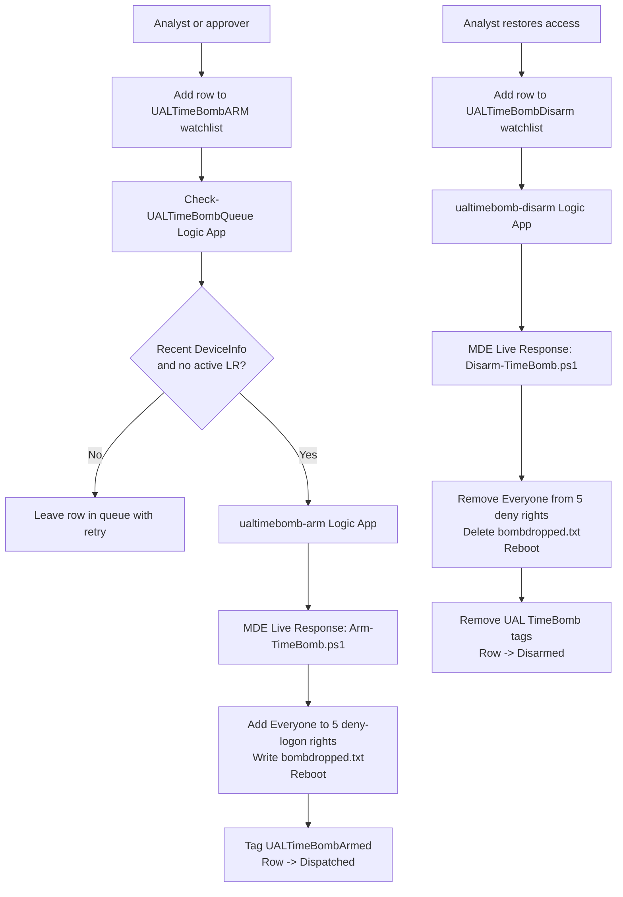

# UAL TimeBomb Live Response

A Microsoft Sentinel + Microsoft Defender for Endpoint workflow that removes or
restores local logon access on a Defender-onboarded Windows endpoint through
MDE Live Response.

UAL TimeBomb preserves the lockout behavior of a customer-provided
access-control script, but replaces Tanium-specific delivery, modules, registry
tags, and local activation timing with Sentinel watchlists, Azure Logic Apps,
and Defender Live Response.

> **This is intentionally disruptive.** The ARM script grants Everyone
> (`S-1-1-0`) five deny-logon rights and reboots the endpoint. Test only on
> disposable, non-production devices with console, snapshot, or other
> out-of-band recovery available.

---

## How It Works



Step by step:

1. **Add a device to the ARM queue.** An analyst adds a row to the
   `UALTimeBombARM` Sentinel watchlist with the MDE device ID. No portal
   tagging required.
2. **Wait for readiness.** `Check-UALTimeBombQueue` runs on a recurrence and
   only picks rows whose device has recent `DeviceInfo` telemetry and no
   active Live Response action.
3. **Dispatch ARM.** The queue checker calls `ualtimebomb-arm`, marks the row
   `Dispatched`, and records the Live Response action ID.
4. **Run ARM on the endpoint.** `ualtimebomb-arm` runs `Arm-TimeBomb.ps1` from
   the MDE Live Response Library.
5. **Lock access.** `Arm-TimeBomb.ps1` adds Everyone to five deny-logon
   rights, verifies the result, writes
   `C:\ProgramData\TimeBomb\bombdropped.txt`, attempts a best-effort logoff of
   active sessions, and reboots.
6. **Mark armed.** On success, `ualtimebomb-arm` removes any trigger tag and
   applies `UALTimeBombArmed`.
7. **Restore access.** An analyst adds a row to `UALTimeBombDisarm`.
   `ualtimebomb-disarm` runs `Disarm-TimeBomb.ps1` through Live Response.
8. **Return to normal.** On success, the DISARM workflow removes UAL TimeBomb
   tags and marks the watchlist row `Disarmed`. It does not leave a success
   tag on the device.

The active workflow does **not** isolate, unisolate, contain, release
containment, or perform any Defender device isolation action. ARM and DISARM
are script-only Live Response workflows.

---

## Requirements

Before you deploy, line up two roles. They are usually two different people.

### Who Deploys The ARM Templates (Step 1)

| Required | Why |
|---|---|
| **`Owner`** on the target Azure subscription, or `Contributor` + `User Access Administrator`. | The templates create Logic Apps, assign Azure RBAC to managed identities, and write a watchlist into the Sentinel workspace. `Contributor` alone cannot create role assignments. |
| Deploy into **the same subscription that contains your Microsoft Sentinel workspace**. | The Logic Apps and watchlist are wired by subscription / resource group / workspace name. Cross-subscription is supported but requires Owner on both subscriptions. |
| **Microsoft Defender for Endpoint** enabled in the same tenant, with at least one onboarded device. | The workflows call the MDE API and run Live Response. |

### Who Runs The Permission Script (Step 2)

| Required | Why |
|---|---|
| Microsoft Entra **Global Administrator** *or* **Privileged Role Administrator** *or* **Cloud Application Administrator** *or* **Application Administrator**. | The script grants Microsoft Defender for Endpoint and Microsoft Threat Protection application roles to Logic App managed identities. Only an Entra admin role can do that — ARM cannot. |
| Azure **`Owner`** or **`User Access Administrator`** on the Sentinel workspace. | The script assigns `Microsoft Sentinel Contributor` on the workspace to the queue and DISARM managed identities so they can read and update watchlist rows. |

### Other Things You Need

```text
Permission to upload files to the MDE Live Response Library
A Microsoft Sentinel workspace in the target tenant
A disposable Windows test device, onboarded to MDE and recently active
Out-of-band recovery for the test device (console, snapshot, or PXE rebuild)
```

---

## Deployment

One guide for both clouds. Any field that differs between Commercial Azure and
Azure Government / GCC High is shown side by side. Click any step to expand.

<details>
<summary><b>Step 1. Click Deploy</b></summary>

Pick your cloud and click the matching button for each component. There is no
single "full deployment" template — UAL TimeBomb deploys as three separate
Logic Apps so that DISARM can be deployed and validated before the ARM queue
is enabled.

Deploy in this order:

1. `ualtimebomb-disarm` first. DISARM is the recovery path. Deploy it before
   anything that can lock a device.
2. `ualtimebomb-arm` second. This is the Live Response payload caller.
3. `Check-UALTimeBombQueue` last. This is the dispatcher that reads the
   `UALTimeBombARM` watchlist and is intentionally left `Disabled` after
   deploy.

| Component | Commercial Azure | Azure Government / GCC High |
|---|---|---|
| DISARM playbook (`ualtimebomb-disarm`) | [](https://portal.azure.com/#create/Microsoft.Template/uri/https%3A%2F%2Fraw.githubusercontent.com%2FCyberlorians%2FUALTimeBomb%2Fmain%2Fdeploy%2Fcommercial%2Fualtimebomb-disarm.json) | [](https://portal.azure.us/#create/Microsoft.Template/uri/https%3A%2F%2Fraw.githubusercontent.com%2FCyberlorians%2FUALTimeBomb%2Fmain%2Fdeploy%2Fgcch%2Fualtimebomb-disarm.json) |
| ARM playbook (`ualtimebomb-arm`) | [](https://portal.azure.com/#create/Microsoft.Template/uri/https%3A%2F%2Fraw.githubusercontent.com%2FCyberlorians%2FUALTimeBomb%2Fmain%2Fdeploy%2Fcommercial%2Fualtimebomb-arm.json) | [](https://portal.azure.us/#create/Microsoft.Template/uri/https%3A%2F%2Fraw.githubusercontent.com%2FCyberlorians%2FUALTimeBomb%2Fmain%2Fdeploy%2Fgcch%2Fualtimebomb-arm.json) |
| ARM queue checker (`Check-UALTimeBombQueue`) | [](https://portal.azure.com/#create/Microsoft.Template/uri/https%3A%2F%2Fraw.githubusercontent.com%2FCyberlorians%2FUALTimeBomb%2Fmain%2Fdeploy%2Fcommercial%2Fcheck-ualtimebomb-queue.json) | [](https://portal.azure.us/#create/Microsoft.Template/uri/https%3A%2F%2Fraw.githubusercontent.com%2FCyberlorians%2FUALTimeBomb%2Fmain%2Fdeploy%2Fgcch%2Fcheck-ualtimebomb-queue.json) |

**Subscription, Resource Group, And Region**

| Portal Field | What To Put |
|---|---|
| Subscription | Subscription where UAL TimeBomb Logic Apps will live. **Use the same subscription that contains the Sentinel workspace** unless you have Owner on both. |
| Resource group | New or existing resource group for the UAL TimeBomb playbooks. The sample parameters use `Playbook`. |
| Region | Any region your subscription has Logic Apps quota in. |
| Location | Generated value matching the region. |

**Sentinel Workspace Values**

All three templates take the same four workspace identifiers.

| Portal Field | Where To Find It |
|---|---|
| Sentinel Workspace Subscription Id | Subscription that contains the Sentinel workspace. Should match the deploy subscription. |
| Sentinel Workspace Resource Group | Resource group of the Log Analytics workspace that has Sentinel enabled. |
| Sentinel Workspace Name | The Log Analytics workspace name. |
| Sentinel Workspace Customer Id | Workspace ID / customer ID GUID from the workspace Overview page. |

**Watchlist Auto-Creation**

| Portal Field | Default | Purpose |
|---|---|---|
| Create Watchlist | `true` | When `true`, the queue checker and DISARM templates create their watchlists (`UALTimeBombARM`, `UALTimeBombDisarm`) with the correct schema and `MdatpDeviceId` search key. Set to `false` only if you intend to import the CSVs manually as described in Step 4. |
| Watchlist Alias | `UALTimeBombARM` / `UALTimeBombDisarm` | Sentinel watchlist alias. Must match across templates and analyst tooling. |

**Schedule And Retry Defaults**

| Portal Field | Default | Purpose |
|---|---|---|
| Poll Frequency Minutes | `60` | How often the queue checker recurrence fires once enabled. |
| Online Window Minutes | `60` | A device must have `SensorHealthState=Active` and recent `DeviceInfo` telemetry within this window to be dispatched. |
| Retry After Hours | `1` | Stale or not-yet-ready rows are deferred this many hours. |
| Live Response Retry After Hours | `2` | Rows blocked by an existing Live Response action are deferred this many hours. |
| Workflow State | `Disabled` | The queue Logic App is created in `Disabled` state on purpose. You enable it in Step 7. |

> **Tuning `Online Window Minutes` after deploy.** Both
> `Check-UALTimeBombQueue` and `ualtimebomb-disarm` carry their own
> `OnlineWindowMinutes` parameter (default `60`). To change it without
> redeploying, open the Logic App in the Azure portal, then **Development
> Tools → Logic app code view**, find the parameter block, edit
> `parameters.OnlineWindowMinutes.defaultValue`, and **Save**:
>
> ```text
> Check-UALTimeBombQueue -> Logic app code view ->
>   "parameters": { "OnlineWindowMinutes": { "type": "Int", "defaultValue": 60 } }
>
> ualtimebomb-disarm     -> Logic app code view ->
>   "parameters": { "OnlineWindowMinutes": { "type": "Int", "defaultValue": 60 } }
> ```
>
> `ualtimebomb-arm` does not have this parameter — readiness is gated by the
> queue checker, not the ARM payload caller. If you prefer the
> infrastructure-as-code path, redeploy the matching template with a new
> `OnlineWindowMinutes` value.

**Cloud-Specific Endpoint Defaults**

Pre-filled per cloud by the matching template. Do not change unless you know
why.

| Portal Field | Commercial Default | GCC High Default |
|---|---|---|
| Defender Api Base Uri | `https://api.securitycenter.microsoft.com` | `https://api-gov.securitycenter.microsoft.us` |
| Defender Api Audience | `https://securitycenter.onmicrosoft.com/windowsatpservice` | `https://api-gov.securitycenter.microsoft.us` |
| Advanced Hunting Api Base Uri | `https://api.security.microsoft.com` | `https://api-gov.security.microsoft.us` |
| Advanced Hunting Api Audience | `https://api.security.microsoft.com` | `https://api-gov.security.microsoft.us` |
| Arm Base Uri | `https://management.azure.com` | `https://management.usgovcloudapi.net` |
| Arm Audience | `https://management.azure.com/` | `https://management.usgovcloudapi.net/` |

For regular GCC (not GCC High), the Defender endpoint is normally
`https://api-gcc.securitycenter.microsoft.us`. Confirm the values for your
specific cloud before deploying — see [deploy/gcch/README.md](deploy/gcch/README.md).

**Review And Create**

For each template, select **Review + create**, wait for validation to pass,
then select **Create**. Wait for `Deployment status: Succeeded`. If a deploy
fails, expand the failed nested deployment in Deployment details to see the
real error.

</details>

<details>
<summary><b>Step 2. Run The Permission Script</b></summary>

> **A Microsoft Entra Global Administrator (or equivalent) with Azure `Owner`
> on the Sentinel workspace must run this step.** The script grants Defender
> for Endpoint and Microsoft Threat Protection application roles to the Logic
> App managed identities, and assigns `Microsoft Sentinel Contributor` on the
> workspace. ARM cannot do this on its own because the API roles live in
> Microsoft Entra ID.

Download the script:

[scripts/Grant-UALTimeBombPermissions.ps1](scripts/Grant-UALTimeBombPermissions.ps1)

Run it from a PowerShell session signed in to the same tenant:

```powershell
# Commercial Azure
az login
.\scripts\Grant-UALTimeBombPermissions.ps1 `
  -SubscriptionId '<subscription-guid>' `
  -PlaybookResourceGroup '<playbook-resource-group>' `
  -SentinelResourceGroup '<sentinel-resource-group>' `
  -SentinelWorkspaceName '<sentinel-workspace-name>'
```

```powershell
# Azure Government / GCC High
az cloud set --name AzureUSGovernment
az login
.\scripts\Grant-UALTimeBombPermissions.ps1 `
  -SubscriptionId '<subscription-guid>' `
  -PlaybookResourceGroup '<playbook-resource-group>' `
  -SentinelResourceGroup '<sentinel-resource-group>' `
  -SentinelWorkspaceName '<sentinel-workspace-name>'
```

Add `-WhatIf` first to preview the RBAC and app-role grants without applying
them.

The script grants:

| Logic App Managed Identity | WindowsDefenderATP App Roles | Microsoft Threat Protection App Roles | Sentinel Workspace RBAC |
|---|---|---|---|
| `Check-UALTimeBombQueue` | `Machine.Read.All`, `Machine.ReadWrite.All` | `AdvancedHunting.Read.All` | `Microsoft Sentinel Contributor` |
| `ualtimebomb-arm` | `Machine.Read.All`, `Machine.ReadWrite.All`, `Machine.LiveResponse` | — | — |
| `ualtimebomb-disarm` | `Machine.Read.All`, `Machine.ReadWrite.All`, `Machine.LiveResponse` | `AdvancedHunting.Read.All` | `Microsoft Sentinel Contributor` |

The script is idempotent. Running it again only adds missing grants. It uses
`az cloud show` so it automatically targets the correct Microsoft Graph
endpoint for the signed-in cloud (commercial vs Government).

</details>

---

## Verification

Click any step to expand. Steps 3 and 4 are one-time setup. Steps 5 and 6 are
the controlled smoke tests. Step 7 turns on the recurrence.

<details>
<summary><b>Step 3. Upload The MDE Live Response Library Files</b></summary>

Two files must exist in the MDE Live Response Library. The names must match
exactly.

| File | Where To Get It |
|---|---|
| `Arm-TimeBomb.ps1` | [src/LiveResponse/Arm-TimeBomb.ps1](src/LiveResponse/Arm-TimeBomb.ps1) in this repo. |
| `Disarm-TimeBomb.ps1` | [src/LiveResponse/Disarm-TimeBomb.ps1](src/LiveResponse/Disarm-TimeBomb.ps1) in this repo. |

Upload both in the Microsoft Defender portal:

```text
Commercial: https://security.microsoft.com
GCC High:   https://security.microsoft.us

Settings -> Endpoints -> Live response -> Library -> Upload file
```

For each file:

1. Select **Upload file**.
2. Pick the matching `.ps1` from `src/LiveResponse`.
3. Leave **Overwrite if exists** checked when refreshing an existing copy.
4. Leave **Has parameters** unchecked. The Logic Apps invoke the scripts
   without parameters.
5. Enter a description such as `UAL TimeBomb ARM payload` or `UAL TimeBomb
   DISARM payload`.
6. Save.

After upload, verify the local file hash matches what you uploaded:

```powershell
Get-FileHash -Algorithm SHA256 .\src\LiveResponse\Arm-TimeBomb.ps1
Get-FileHash -Algorithm SHA256 .\src\LiveResponse\Disarm-TimeBomb.ps1
```

> **GCC High portal upload fallback:** the GCCH Defender portal sometimes
> rejects Library uploads with the generic error `Failed to upload file —
> A problem occurred while running the command.` The MDE API accepts the
> same files when called with an app that has `Machine.LiveResponse` and
> `Library.Manage` on the WindowsDefenderATP enterprise app. If you hit
> this, register a temporary app, grant those two roles, and POST each
> file to `https://api-gov.securitycenter.microsoft.us/api/libraryfiles`
> as `multipart/form-data`. Delete the temporary app once the upload
> succeeds.

</details>

<details>
<summary><b>Step 4. Confirm The Sentinel Watchlists</b></summary>

If you deployed Step 1 with `Create Watchlist = true` (the default), both
watchlists already exist with the correct schema. Verify them:

```text
1. In Microsoft Sentinel, open the same workspace you used at deploy.
2. Configuration -> Watchlists.
3. Confirm both rows are present:
     - Alias: UALTimeBombARM      Display name: UAL TimeBomb ARM Queue
     - Alias: UALTimeBombDisarm   Display name: UAL TimeBomb Disarm Queue
4. Open each watchlist and confirm the search key is MdatpDeviceId and the
   placeholder row MdatpDeviceId=SAMPLE-DO-NOT-RUN is present.
```

If you set `Create Watchlist = false`, or you want to recreate from the
canonical CSV, import the starter file manually:

| Watchlist | Starter CSV |
|---|---|
| `UALTimeBombARM` | [assets/watchlists/UALTimeBombARM.csv](assets/watchlists/UALTimeBombARM.csv) |
| `UALTimeBombDisarm` | [assets/watchlists/UALTimeBombDisarm.csv](assets/watchlists/UALTimeBombDisarm.csv) |

Manual import per watchlist:

```text
1. Download the matching CSV from this repo (raw).
2. In Microsoft Sentinel, Configuration -> Watchlists -> + New.
3. General tab:
     Name:        UAL TimeBomb ARM Queue   (or UAL TimeBomb Disarm Queue)
     Alias:       UALTimeBombARM           (or UALTimeBombDisarm)
                  (alias MUST match the WatchlistAlias deploy parameter)
     Description: UAL TimeBomb ARM queue   (or DISARM queue)
4. Source tab:
     Source type:           Local file
     File:                  upload the CSV
     Number of header rows: 1
     Search key:            MdatpDeviceId
5. Review and create -> Create.
```

Column reference (same schema for both watchlists):

| Column | Purpose |
|---|---|
| `MdatpDeviceId` | Defender for Endpoint machine ID. Required. Watchlist search key. |
| `DeviceName` | Human-readable endpoint name. Optional. |
| `IncidentId` | Sentinel incident, case, change, or approval reference. Optional. |
| `Reason` | Reason for access lockout or restore. Optional. |
| `RequestedBy` | Analyst or approval identity. Optional. |
| `EnqueuedTime` | Filled by the queue workflow when it first processes the row. |
| `Attempts` | Dispatch attempt count. Incremented by the workflow. |
| `Status` | Blank or `Pending` is treated as ready. Other values: `Retry`, `BlockedLiveResponse`, `Dispatched`, `Disarmed`, `Template`. |
| `RetryAfterUtc` | UTC retry gate for stale or blocked devices. |
| `LastAttemptUtc` | Last processing time. |
| `LastError` | Last workflow error or readiness message. |
| `LastActionId` | Workflow run or Defender action ID. |

</details>

<details>
<summary><b>Step 5. Run One Controlled ARM Test</b></summary>

> **Use a disposable device only.** A successful ARM run locks out every
> interactive, network, batch, service, and remote-interactive logon for
> `Everyone`, including local administrators, and reboots the box. Make sure
> you have console, snapshot, or PXE recovery before you trigger this.

1. Pick one onboarded MDE device that has been seen by Defender in the last
   hour and can run Live Response.
2. In Microsoft Sentinel, open **Configuration → Watchlists →
   UALTimeBombARM**.
3. **Update watchlist → Add new item**:
   - `MdatpDeviceId` = the MDE device ID of the test device
   - `DeviceName` = friendly name
   - `Reason` = `Controlled ARM test`
   - `RequestedBy` = your identity
   - `Status` = leave blank (treated as pending)
4. Save.
5. Open **Check-UALTimeBombQueue** Logic App → **Overview → Enable**.
6. **Run Trigger → Run** to dispatch immediately instead of waiting for the
   recurrence.
7. Watch **ualtimebomb-arm** start in its run history.
8. In MDE, confirm a Live Response machine action for the device with
   `requestor = ualtimebomb-arm` and `ScriptName = Arm-TimeBomb.ps1` reaches
   `Succeeded` with command status `Completed`.
9. Confirm the watchlist row moves to `Status = Dispatched` with
   `LastActionId` populated.
10. Confirm the MDE machine tag `UALTimeBombArmed` appears on the device
    (tag propagation can lag a few minutes; Live Response success is the
    ground truth).
11. From a recovery session on the endpoint, confirm:
    - `C:\ProgramData\TimeBomb\bombdropped.txt` exists.
    - Everyone (`S-1-1-0`) is present on all five deny-logon rights
      (`SeDenyBatchLogonRight`, `SeDenyInteractiveLogonRight`,
      `SeDenyNetworkLogonRight`, `SeDenyRemoteInteractiveLogonRight`,
      `SeDenyServiceLogonRight`).
12. **Immediately disable the queue checker again** until DISARM has been
    proven: **Check-UALTimeBombQueue → Overview → Disable**.

[scripts/Get-UALTimeBombEndpointState.ps1](scripts/Get-UALTimeBombEndpointState.ps1)
is a one-shot endpoint verifier you can run via Azure Run Command or any
out-of-band session to dump `BombDropped` and all five deny-right booleans as
JSON.

If any step fails, see Troubleshooting below.

</details>

<details>
<summary><b>Step 6. Run One Controlled DISARM Test</b></summary>

DISARM is intentionally watchlist-driven. There is no MDE tag that triggers
restore.

1. In Microsoft Sentinel, open **Configuration → Watchlists →
   UALTimeBombDisarm**.
2. **Update watchlist → Add new item**:
   - `MdatpDeviceId` = the MDE device ID of the armed test device
   - `DeviceName` = friendly name
   - `Reason` = `Controlled DISARM test`
   - `RequestedBy` = your identity
   - `Status` = leave blank
3. Save.
4. Open **ualtimebomb-disarm** Logic App → **Run Trigger → Run** to dispatch
   immediately instead of waiting for any external trigger.
5. In MDE, confirm a Live Response machine action with `requestor =
   ualtimebomb-disarm` and `ScriptName = Disarm-TimeBomb.ps1` reaches
   `Succeeded`.
6. Confirm the watchlist row moves to `Status = Disarmed` with `LastActionId`
   populated.
7. Confirm no UAL TimeBomb tags remain on the device in MDE.
8. From the endpoint after reboot, confirm:
   - `C:\ProgramData\TimeBomb\bombdropped.txt` is absent.
   - Everyone (`S-1-1-0`) is absent from all five deny-logon rights.

</details>

<details>
<summary><b>Step 7. Enable The Queue Checker</b></summary>

Only after Steps 5 and 6 have both passed end-to-end at least once:

```text
1. Open the Check-UALTimeBombQueue Logic App.
2. Overview -> Enable.
```

The recurrence trigger will now poll on the schedule set at deploy time
(default: every 60 minutes). The DISARM playbook (`ualtimebomb-disarm`) is
triggered by row writes against `UALTimeBombDisarm` and does not need a
separate enable step.

</details>

---

## Repository Layout

| Path | Purpose |
|---|---|
| [deploy/commercial](deploy/commercial) | Commercial Azure ARM templates and sample parameters. |
| [deploy/gcch](deploy/gcch) | Azure Government / GCC High ARM templates and sample parameters. |
| [assets/watchlists](assets/watchlists) | Sentinel watchlist CSV starters for ARM and DISARM queues. |
| [scripts](scripts) | Permission helper, endpoint verifier, and no-reboot recovery helper. |
| [src/LiveResponse](src/LiveResponse) | PowerShell scripts uploaded to the MDE Live Response Library. |
| [TESTING.md](TESTING.md) | Public-safe validation log for ARM, DISARM, and queue paths. |

---

## Tag Model

| Workflow | Trigger Tag | Success State | Failure Tag |
|---|---|---|---|
| ARM | none (watchlist-driven) | `UALTimeBombArmed` | `UALTimeBombArmFailed` |
| DISARM | none (watchlist-driven) | no UAL TimeBomb tags remain | `UALTimeBombDisarmFailed` |

The DISARM workflow removes `UALTimeBombArmed`, legacy `UALTimeBombDeployed`,
`UALTimeBombRestore`, and `UALTimeBombDisarmed` best effort after the restore
script succeeds. It does **not** leave a "disarmed" success marker tag on the
device.

---

## Endpoint Effect

`Arm-TimeBomb.ps1` adds Everyone (`S-1-1-0`) to these local security policy
rights using the native LSA API, then verifies with `secedit /export`:

```text
SeDenyBatchLogonRight
SeDenyInteractiveLogonRight
SeDenyNetworkLogonRight
SeDenyRemoteInteractiveLogonRight
SeDenyServiceLogonRight
```

> **Deny rights take precedence over allow rights.** This can block local
> administrators too.

State path on the endpoint: `C:\ProgramData\TimeBomb`. Sentinel file:
`bombdropped.txt`. The script is idempotent: re-running on an already-armed
device is a no-op.

`Disarm-TimeBomb.ps1` removes **only** Everyone from those same rights and
preserves any other existing assignees. It deletes
`C:\ProgramData\TimeBomb\bombdropped.txt` and reboots unless `-NoReboot` is
supplied. A non-reboot recovery helper for out-of-band restore is in
[scripts/Clear-UALTimeBombRightsNoReboot.ps1](scripts/Clear-UALTimeBombRightsNoReboot.ps1).

---

## Readiness Checks

The queue and disarm workflows use Defender Advanced Hunting `DeviceInfo`
telemetry for freshness checks because the legacy machine entity endpoint can
lag behind portal/device telemetry.

Readiness requires:

```text
OnboardingStatus = Onboarded
SensorHealthState = Active
Latest DeviceInfo timestamp within OnlineWindowMinutes
No Pending or InProgress Live Response action on the device
```

If a device is stale, offline, not onboarded, or blocked by another Live
Response action, the workflow updates the watchlist row and waits for a later
retry. It does not repeatedly probe Live Response just to check readiness.

---

## Troubleshooting Quick Checks

### Deployment Fails At Sentinel Watchlist Creation

Either the deployer does not have RBAC on the Sentinel workspace resource
group, or the workspace name / resource group / subscription parameters do
not resolve to a real Sentinel-enabled workspace. Set
`Create Watchlist = false` and import the CSVs manually per Step 4 to unblock,
then fix the workspace parameters on the next deploy.

### MDE API Calls Return 403

Re-run [scripts/Grant-UALTimeBombPermissions.ps1](scripts/Grant-UALTimeBombPermissions.ps1)
and confirm grants on both enterprise apps:

```text
WindowsDefenderATP:
  Machine.Read.All
  Machine.ReadWrite.All
  Machine.LiveResponse           (ualtimebomb-arm, ualtimebomb-disarm)

Microsoft Threat Protection:
  AdvancedHunting.Read.All       (Check-UALTimeBombQueue, ualtimebomb-disarm)
```

App-role assignments can take a minute or two to propagate to a token. If you
just granted them, wait and rerun.

### Queue Finds No Ready Devices

A running VM is not enough. The device must be:

```text
Onboarded to MDE
SensorHealthState = Active
Has DeviceInfo telemetry inside OnlineWindowMinutes
Has no Pending or InProgress Live Response action
```

Lower `OnlineWindowMinutes` only after you understand the trade-off; very
recent installs may not have telemetry in Advanced Hunting yet.

### Live Response Does Not Start

Check for another `Pending` or `InProgress` Live Response action on the same
device. The workflows intentionally block and retry rather than colliding
with an existing session. Cancel the stale action in MDE
(`POST /api/machineactions/{id}/cancel`) if it is no longer needed.

### Device Still Has UAL Tags After DISARM

Confirm the deployed DISARM template is the current version. Earlier
prototypes could leave a disarmed marker tag; the current workflow removes
UAL TimeBomb tags after successful restore. If tags remain, run the DISARM
playbook again — it is idempotent.

### GCC High Endpoint Mismatch

If the GCC High Logic Apps return DNS, 401, or audience errors, recheck the
`DefenderApiBaseUri`, `DefenderApiAudience`, `AdvancedHuntingApiBaseUri`,
`AdvancedHuntingApiAudience`, `ArmBaseUri`, and `ArmAudience` parameters
against your tenant. Regular GCC (not GCC High) uses different Defender host
names than GCC High. See [deploy/gcch/README.md](deploy/gcch/README.md).

---

## Individual Deployment Buttons

Use these when redeploying a single component.

| Component | Commercial | GCC High |
|---|---|---|
| ARM playbook | [](https://portal.azure.com/#create/Microsoft.Template/uri/https%3A%2F%2Fraw.githubusercontent.com%2FCyberlorians%2FUALTimeBomb%2Fmain%2Fdeploy%2Fcommercial%2Fualtimebomb-arm.json) | [](https://portal.azure.us/#create/Microsoft.Template/uri/https%3A%2F%2Fraw.githubusercontent.com%2FCyberlorians%2FUALTimeBomb%2Fmain%2Fdeploy%2Fgcch%2Fualtimebomb-arm.json) |
| DISARM playbook | [](https://portal.azure.com/#create/Microsoft.Template/uri/https%3A%2F%2Fraw.githubusercontent.com%2FCyberlorians%2FUALTimeBomb%2Fmain%2Fdeploy%2Fcommercial%2Fualtimebomb-disarm.json) | [](https://portal.azure.us/#create/Microsoft.Template/uri/https%3A%2F%2Fraw.githubusercontent.com%2FCyberlorians%2FUALTimeBomb%2Fmain%2Fdeploy%2Fgcch%2Fualtimebomb-disarm.json) |
| ARM queue checker | [](https://portal.azure.com/#create/Microsoft.Template/uri/https%3A%2F%2Fraw.githubusercontent.com%2FCyberlorians%2FUALTimeBomb%2Fmain%2Fdeploy%2Fcommercial%2Fcheck-ualtimebomb-queue.json) | [](https://portal.azure.us/#create/Microsoft.Template/uri/https%3A%2F%2Fraw.githubusercontent.com%2FCyberlorians%2FUALTimeBomb%2Fmain%2Fdeploy%2Fgcch%2Fcheck-ualtimebomb-queue.json) |
